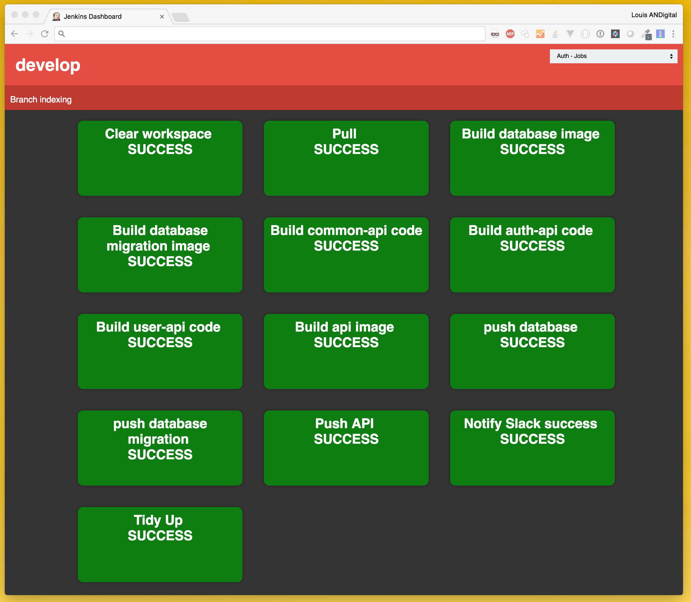

# Jenkins Latest Build Dashboard

This is a very rough and ready latest build dashboard for Jenkins using the Blue Ocean REST API.

## Deployment

Copy the file to: `/var/lib/jenkins/userContent/` e.g. `/var/lib/jenkins/userContent/my-dashboard.html`

This will then be accessible from `http://my-jenkins:8080/userContent/my-dashboard.html`

## Example

